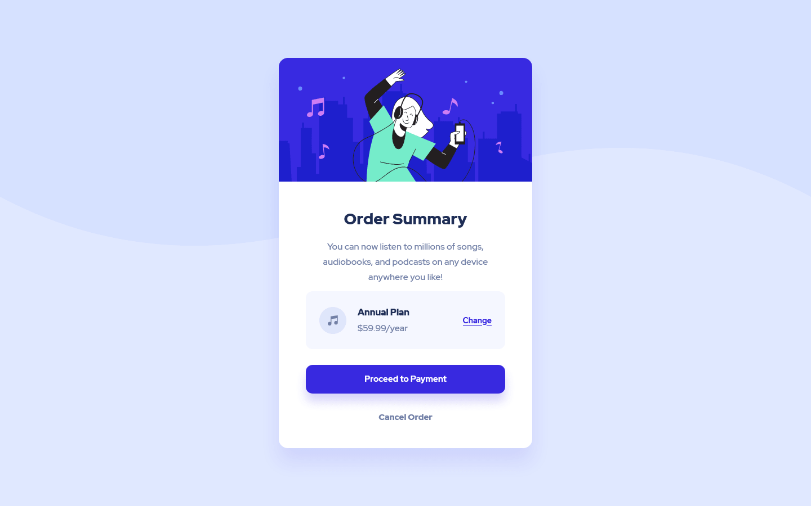

# Frontend Mentor - Order Summary Component

This is my solution to the ['Order summary card' challenge on Frontend Mentor](https://www.frontendmentor.io/challenges/order-summary-component-QlPmajDUj).

## Table of contents

- [Overview](#overview)
  - [The challenge](#the-challenge)
  - [Screenshot](#screenshot)
  - [Links](#links)
- [My process](#my-process)
  - [Built with](#built-with)
  - [What I learned](#what-i-learned)
- [Author](#author)

## Overview

### The challenge

Make an order summary card using the assets provided and try and make it look as close to the design as possible.

Users should be able to:

- See hover states for interactive elements

### Screenshot

Two screenshots are available:

- [Mobile](./screenshots/mobile.png)
- [Desktop](./screenshots/desktop.png)

### Links

- [Live Site URL](https://idiotic-enigma.github.io/order-summary-component)

## My process

Rather than use a mobile-first or desktop-first approach, I instead opted to experiment with setting default styles first, then use media queries for styles that change based on viewport size. Given that this project is creating a single component, implementing this approach was not difficult. I am however interested to see how well this approach would work on other larger scale projects in the future.

Additionally, I also included my own styles for 'focus' effects on links. I'm not entirely sure if they work well design-wise, but I tried!

CSS Grid is only used to organise and align both the component itself and the attribution blurb at the bottom of the page (not seen in the screenshots). Flexbox would have been a fine substitute for this.

Flexbox is used to align the items in the 'Annual Plan' section.

Overall, this was a nice, small-scale project to help re-familiarise myself with modern CSS.

### Built with

- Semantic HTML5 markup
- SCSS
- Flexbox
- CSS Grid

### What I learned

I believe this project helped refine how I architect my code, particularly in aspects such as:
- Splitting and organising my SCSS into managable, understandable files
- Using SCSS variables and maps
- Identifying ways to reuse code in different contexts

## Author

- Frontend Mentor - [@idiotic-enigma](https://www.frontendmentor.io/profile/idiotic-enigma)